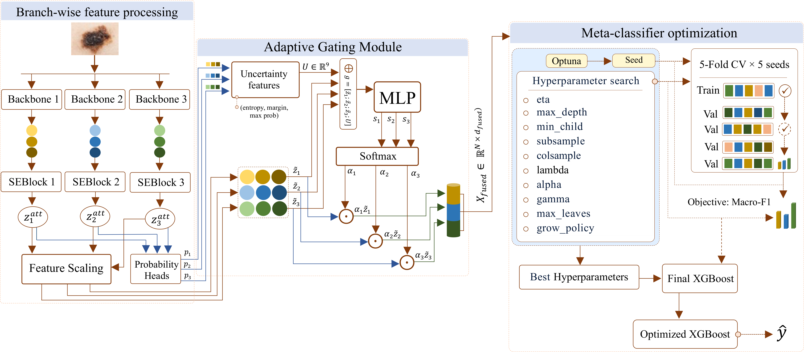

# UAGF: Uncertainty-Guided Adaptive Gated Fusion for Skin Lesion Classification

Official implementation of **"Enhancing Skin Lesion Classification via Uncertainty-Guided Adaptive Gated Fusion of Multiple Backbones"** (Expert Systems with Applications, 2026).

## Overview

UAGF is a multi-backbone fusion framework that adaptively combines features from ConvNeXt-V2, Swin Transformer, and EfficientNet-B3 using an uncertainty-guided gating mechanism. The key components include:

– **Squeeze-and-Excitation (SE) blocks** for channel-wise feature recalibration

– **Per-branch temperature scaling** for calibrated uncertainty estimation

– **MLP-based gating network** that uses entropy, max probability, and margin to compute per-sample fusion weights

– **Optuna-optimized XGBoost** meta-classifier on fused features

## Architecture



## Results

| Dataset  | Accuracy | F1-Score | Precision | Recall |
|----------|----------|----------|-----------|--------|
| ISIC2018 | 95.39    | 94.50    | 94.54     | 94.64  |
| ISIC2019 | 94.49    | 91.77    | 92.13     | 91.35  |

## Installation

```bash
git clone https://github.com/Biomedical-lab/UAGF.git
cd UAGF
pip install -r requirements.txt
```

## Project Structure

```
UAGF/
├── config/
│   ├── isic2018.yaml          # ISIC2018 dataset configuration
│   └── isic2019.yaml          # ISIC2019 dataset configuration
├── models/
│   ├── se_block.py            # Squeeze-and-Excitation block
│   ├── fusion_module.py       # Adaptive Fusion Module with gating
│   └── temperature.py         # Post-hoc temperature scaling
├── utils/
│   ├── data_loader.py         # Feature loading and preprocessing
│   └── metrics.py             # Evaluation metrics
├── train_backbone.py          # Backbone fine-tuning and feature extraction
├── train.py                   # Main UAGF training pipeline
├── evaluate.py                # Multi-seed evaluation and ablation study
└── visualize.py               # SHAP, t-SNE, confusion matrix, ROC plots
```

## Usage

### 1. Backbone Feature Extraction

Fine-tune each backbone on your ISIC dataset and extract features:

```bash
python train_backbone.py --config config/isic2018.yaml --backbone convnext --data_dir /path/to/images
python train_backbone.py --config config/isic2018.yaml --backbone swin --data_dir /path/to/images
python train_backbone.py --config config/isic2018.yaml --backbone efficientnet --data_dir /path/to/images
```

Features are saved as CSV files in the directory specified by `feature_dir` in the config.

### 2. Train UAGF

```bash
python train.py --config config/isic2018.yaml
```

This runs the full pipeline:
1. Trains the SE + Gating module with label smoothing
2. Fits per-branch temperature scaling on the validation set
3. Extracts fused features with calibrated temperatures
4. Optimizes XGBoost hyperparameters via Optuna (100 trials)
5. Evaluates on the test set

### 3. Evaluate

```bash
# Full evaluation (multi-seed + ablation + complexity)
python evaluate.py --config config/isic2018.yaml --mode all

# Multi-seed only (5 seeds + statistical significance)
python evaluate.py --config config/isic2018.yaml --mode multiseed

# Ablation study only
python evaluate.py --config config/isic2018.yaml --mode ablation
```

### 4. Visualize

```bash
# All visualizations
python visualize.py --config config/isic2018.yaml --plot all

# Specific plots
python visualize.py --config config/isic2018.yaml --plot confusion_matrix
python visualize.py --config config/isic2018.yaml --plot shap
python visualize.py --config config/isic2018.yaml --plot tsne
python visualize.py --config config/isic2018.yaml --plot roc
```

## Data Preparation

Download the ISIC datasets:
– [ISIC 2018](https://challenge.isic-archive.com/landing/2018/)

– [ISIC 2019](https://challenge.isic-archive.com/landing/2019/)

Place extracted backbone features in `data/ISIC2018/` and `data/ISIC2019/` with the naming convention specified in the config files.

> **Note**: Feature CSV files can be reproduced by running `train_backbone.py`. Due to their large size, they are not included in this repository.

## Requirements

– Python >= 3.8

– PyTorch >= 1.12

– CUDA-capable GPU (tested on NVIDIA GeForce RTX 5090)

See `requirements.txt` for the full dependency list.

## Citation

```bibtex
@article{NGUYEN2026133657,
  title={Enhancing Skin Lesion Classification via Uncertainty-Guided Adaptive Gated Fusion of Multiple Backbones},
  author={Ba-Duy Nguyen and Van-Dung Hoang and Hien D. Nguyen},
  journal={Expert Systems with Applications},
  pages={133657},
  year={2026},
  issn={0957-4174},
  doi={https://doi.org/10.1016/j.eswa.2026.133657},
  url={https://www.sciencedirect.com/science/article/pii/S0957417426025650}
}
```

## Acknowledgment

This research was supported by The VNUHCM-University of Information Technology's Scientific Research Support Fund.

## License

This project is licensed under the MIT License - see the [LICENSE](LICENSE) file for details.
